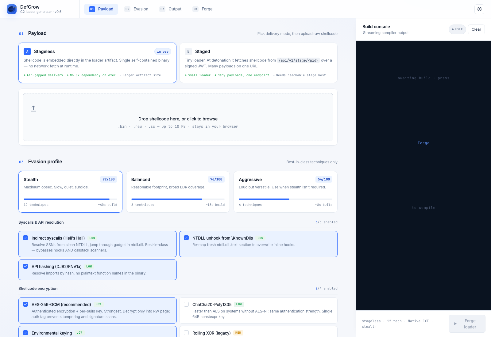

<div align="center">

# DefCrow

**A Rust-powered C2 loader generator for authorized red-team engagements.**

Generates 14 evasion-aware loader formats (PE, DLL, .NET, VBA, WSF, HTA, SCT, MSBuild, XSL, INF) from a single shellcode source, behind an authenticated operator console.



</div>

---

> ⚠️ **For authorized security testing only.** DefCrow is research tooling intended for red-team engagements, internal security assessments, and offensive-security education. Do not use it against systems you do not have explicit written permission to test.

## Highlights

- **14 loader families** generated from one shellcode blob — `Binary`, `Dll`, `Rundll32`, `Injector`, `AppDomain`, `InstallUtil`, `Wsf`, `Hta`, `Regsvr32Sct`, `MsBuild`, `Cmstp`, `WmicXsl`, `DocxMacro`, `XlsxMacro`
- **OPSEC-first templates** — per-build XOR registry arrays, AES-256 + ChaCha20 + RC4 shellcode encryption, randomized identifiers, charcode-obfuscated registry paths, no plaintext IOCs in generated artifacts
- **EDR evasion in C# stubs** — patchless AMSI / ETW bypass, NTDLL unhooking from disk, direct syscalls with SSN extraction (AppDomainManager, InstallUtil, MsBuild)
- **Staged + stageless** delivery — every loader can fetch shellcode from `/api/v1/stage` with XOR-encoded URL/JWT/User-Agent, or embed it directly
- **HTML smuggling delivery** out of the box with arbitrary file extension masking
- **2-step Discord-key login** — username → one-time 8-char key delivered to Discord → JWT session, no passwords on disk
- **Admin operator management** — admin-gated CRUD for users and global auth webhook, refuses last-admin / self-delete
- **Compression** of large beacons (Cobalt Strike-class shellcode) via per-build zlib + decompress stub for C# loaders
- **React frontend** with Clean / Hacker themes, live build console, and per-loader configuration UI

## Architecture

```
┌──────────────────┐      HTTP/WS      ┌──────────────────────────────────┐
│  React frontend  │  ───────────────► │  Axum web-server (Rust)          │
│  (Vite + TS)     │ ◄───────────────  │  - JWT session auth (HS256)      │
│  - LoginPage     │                   │  - Discord-key delivery          │
│  - GeneratorPage │                   │  - Admin users + auth settings   │
│  - SettingsPage  │                   │  - Job queue + WebSocket stream  │
└──────────────────┘                   └────────────┬─────────────────────┘
                                                    │
                                                    ▼
                                       ┌──────────────────────────────────┐
                                       │  template-engine (Rust)          │
                                       │  - Tera-driven loader templates  │
                                       │  - 14 loader families            │
                                       │  - Encryption + obfuscation      │
                                       │  - Optional shellcode compress   │
                                       └────────────┬─────────────────────┘
                                                    │
                                                    ▼
                                       ┌──────────────────────────────────┐
                                       │  builder / scaffold              │
                                       │  - cargo / msbuild / vbac        │
                                       │  - Stage + smuggler artifacts    │
                                       └──────────────────────────────────┘
```

| Crate | Responsibility |
|-------|----------------|
| `template-engine` | Loader templates + render pipeline (Tera) |
| `web-server`      | Axum HTTP/WS server, auth, job queue, admin |
| `frontend`        | React + Vite operator console |
| `scaffold`        | Shared Rust runtime crate linked into Rust loaders |

## Quick start

### Requirements

- Rust **1.75+** (stable)
- Node.js **20+**
- macOS, Linux, or Windows
- Optional, for building Windows loaders end-to-end:
  - `mingw-w64` cross toolchain (`x86_64-pc-windows-gnu`)
  - `msbuild` for C# variants
  - `vbac` / `oletools` for VBA macros

### Run the operator console

```bash
# 1. Frontend bundle
cd frontend && npm install && npm run build && cd ..

# 2. Bootstrap config (copy to .env and edit)
cp .env.example .env

# 3. Start the server
cargo run -p web-server
```

Server defaults to `http://127.0.0.1:8080`. On first start it bootstraps an `admin` user in `${DEFCROW_ARTIFACTS_DIR}/users.json` and tells you to set the global Discord webhook before logging in.

### First login

1. Open the console, enter the bootstrap username (`admin` by default).
2. The server delivers a one-time 8-character key to the configured Discord webhook.
3. Paste the key — you receive a JWT session valid for 24h.

To bootstrap with the webhook already wired, set `DEFCROW_BOOTSTRAP_WEBHOOK` before the first start.

## Configuration

All knobs live in environment variables — see [`.env.example`](.env.example) for the full list.

| Variable | Default | Purpose |
|----------|---------|---------|
| `DEFCROW_SESSION_SECRET` | *(required)* | HMAC key for session JWTs |
| `DEFCROW_PORT` | `8080` | HTTP bind port |
| `DEFCROW_ARTIFACTS_DIR` | `/tmp/defcrow-artifacts` | Where users.json, stages, builds live |
| `DEFCROW_BOOTSTRAP_USERNAME` | `admin` | Seeded on first run |
| `DEFCROW_BOOTSTRAP_WEBHOOK` | *(unset)* | Optional — seeds `auth_settings.json` |

## Generated loader matrix

| Loader | Extension | Runtime | EDR tradecraft |
|--------|-----------|---------|----------------|
| Binary | `.exe` | Native PE | AMSI/ETW HWBP, sleep encrypt |
| Dll | `.dll` | Native PE | Same + DllMain entry |
| Rundll32 | `.dll` | Native PE | Same + exported entry |
| Injector | `.exe` | Native PE | Remote injection + syscalls |
| AppDomain | `.cs/.dll` | .NET (CLR4) | Patchless AMSI/ETW + NTDLL unhook + direct syscall, host: MSBuild/InstallUtil/FileHistory |
| InstallUtil | `.exe/.cs` | .NET | Same |
| Wsf | `.wsf` | WSH JScript | Ascii-safe, com-stub + Excel COM injection (opt-in) |
| Hta | `.hta` | mshta | VBScript launcher |
| Regsvr32Sct | `.sct` | regsvr32 scriptlet | XML-only delivery |
| MsBuild | `.csproj` | MSBuild inline-task | Patchless + syscalls |
| Cmstp | `.inf` | cmstp.exe | InfDefaultInstall |
| WmicXsl | `.xsl` | wmic format | XSL transform exec |
| DocxMacro | `.bas` | Word VBA | CallWindowProc trick |
| XlsxMacro | `.bas` | Excel VBA | Workbook_Open / Auto_Open |

Every text-based loader (WSF/HTA/SCT/XSL/INF/VBA) is 100% ASCII to avoid WSH/parser codepage bugs.

## Project layout

```
DefCrow/
├── frontend/              React + Vite operator console
├── template-engine/       Loader templates + Tera renderer
│   ├── src/
│   ├── templates/         Per-loader .tera files
│   └── examples/          Standalone render harnesses
├── web-server/            Axum HTTP/WS server
│   ├── src/
│   │   ├── api/           Route handlers (auth, generate, jobs, admin, stage, smuggler)
│   │   ├── auth/          Users / key store / settings / Discord delivery
│   │   ├── builder/       Cargo / msbuild / vbac job runner
│   │   ├── middleware/    Auth + admin guards
│   │   └── ws/            Live build progress
│   └── tests/
├── scaffold/              Rust runtime crate shared by native loaders
└── .env.example           Configuration template
```

## Security model

- **No passwords on disk.** Login is 2-step: username + one-time key delivered via Discord (HMAC-SHA256 stored, 300s TTL, one-time).
- **JWT session** signed with `DEFCROW_SESSION_SECRET` (HS256). Schema version bump (`ver=2`) invalidates outstanding tokens on incompatible migrations.
- **Admin gating** sits on top of `require_auth` — admin routes check the injected `SessionClaims.role`.
- **SSRF prevention** on the auth webhook — must be `discord.com` / `discordapp.com`.
- **Rate limiting** — per-username (3/min on `/request-key`, 5/min on `/login`) + per-IP (20/min) sliding window with hard map cap.
- **Atomic file writes** for `users.json` and `auth_settings.json` via tempfile + rename.
- **User-existence oracle closed** — `/request-key` returns identical `{delivered: true}` for known and unknown usernames.

See `docs/superpowers/specs/` for the design docs and `docs/superpowers/plans/` for the implementation plans behind each subsystem.

## Development

```bash
# Backend unit + integration tests
cargo test --workspace

# Frontend tests (vitest)
cd frontend && npm test

# Lint
cd frontend && npm run lint
```

A standalone audit harness renders every loader against a real beacon and validates structure per target runtime:

```bash
cargo run -p template-engine --example audit_all_loaders
```

## Credits

- Rust 2021 edition, Axum 0.7, Tera 1.x, React 18, Vite 5
- Vendored open-source offensive tooling (with attribution preserved in commit history):
  - Selected templates inspired by [ScareCrow](https://github.com/optiv/ScareCrow) (Matthew Eidelberg / Optiv)
  - VBA tradecraft references from [mgeeky](https://github.com/mgeeky)'s research

## License

MIT — see [`LICENSE`](LICENSE).

This software is released for research and educational purposes. The author assumes no liability for misuse.
